# 🎮 Projet Java Débutant : Disney Dungeon

Disney Dungeon est un petit jeu en Java conçu pour apprendre les bases de la programmation orientée objet. 
Le joueur crée un personnage (Guerrier ou Magicien), lui attribue un équipement, puis interagit avec un menu en console pour afficher ou modifier ses informations. Dans les étapes suivantes du projet, le personnage pourra avancer sur un plateau de 64 cases grâce à un lancer de dé virtuel. L’objectif principal n’est pas de créer un jeu complet, mais de comprendre comment structurer un projet Java avec plusieurs classes, comment manipuler des objets, et comment organiser la logique d’un programme. 

### 📌 Fonctionnalités

- Création d’un personnage (type + nom)
- Gestion de l’équipement offensif et défensif
- Affichage des informations du personnage
- Modification des informations
- Menu simple en console
- Préparation du plateau de jeu (64 cases)

### 🛠️ Technologies utilisées

- Java 17+
- IntelliJ IDEA (ou autre IDE Java)
- Programmation orientée objet (classes, objets, getters/setters, constructeurs)
- Scanner pour lire les choix de l’utilisateur

## 🚀 Démarrage rapide

### Prérequis

- Java installé sur l’ordinateur  
- Un IDE (IntelliJ, Eclipse, VS Code…)

### Installation

Cloner le dépôt :

```
git clone https://github.com/priscillamandon-a11y/JAVA-jeu-DisneyDungeon.git
```

Ouvrir le projet dans votre IDE, puis lancer la classe : `Main.java`

---

## 🔧 Diagramme UML

```mermaid
classDiagram
    %% core game classes
    class Game {
        - Character character
        - Board board
        - Dice dice
        + startGame()
        + playTurn()
    }

    class Menu {
        + showMainMenu()
        + askCharacter()
        + showCharacter()
    }

    class Character {
        - String type
        - String name
        - int life
        - int attack
        - OffensiveEquipement offensiveEq
        - DefensiveEquipement defensiveEq
        + getters/setters()
        + toString()
    }

    class Warrior {
        + Warrior(name, defensiveEquipement, offensiveEquipement)
        + toString()
    }
    class Wizard {
        + Wizard(name, defensiveEquipement, offensiveEquipement)
        + toString()
    }
    Character <|-- Warrior
    Character <|-- Wizard

    %% equipment hierarchies
    class OffensiveEquipement {
        - String type
        - int attackLevel
        - String name
    }
    class BasicSpell
    class ArielStorm
    class DragonFire
    class LightningZeus
    OffensiveEquipement <|-- BasicSpell
    OffensiveEquipement <|-- ArielStorm
    OffensiveEquipement <|-- DragonFire
    OffensiveEquipement <|-- LightningZeus

    class BasicWeapon
    class HerculeSword
    class KingTritonTrident
    class SultanSword
    OffensiveEquipement <|-- BasicWeapon
    OffensiveEquipement <|-- HerculeSword
    OffensiveEquipement <|-- KingTritonTrident
    OffensiveEquipement <|-- SultanSword

    class DefensiveEquipement {
        - String type
        - int defenseLevel
        - String name
    }
    class BasicShield
    class BlueFairyShield
    class HerculeShield
    DefensiveEquipement <|-- BasicShield
    DefensiveEquipement <|-- BlueFairyShield
    DefensiveEquipement <|-- HerculeShield

    class BiscuitSimba
    class ElixirMulan
    class EnchantedRedApple
    class PotionTinkerbell
    DefensiveEquipement <|-- BiscuitSimba
    DefensiveEquipement <|-- ElixirMulan
    DefensiveEquipement <|-- EnchantedRedApple
    DefensiveEquipement <|-- PotionTinkerbell

    %% board cases
    class Cell {
        + String getType()
        + String toString()
        + Enemy getEnemy()
        + DefensiveEquipement getDefensiveEquipement()
        + OffensiveEquipement getOffensiveEquipement()
    }
    class EmptyCell
    class EnemyCell
    class PotionCell
    class WeaponCell
    Cell <|-- EmptyCell
    Cell <|-- EnemyCell
    Cell <|-- PotionCell
    Cell <|-- WeaponCell

    %% enemies
    class Enemy {
        - String name
        - String description
        - String type
        - int lifeLevel
        - int attackPower
        - int defense
        + getters/setters()
        + toString()
    }
    class Maleficent
    class ScarLion
    class SnakeKaa
    class ProwlerOfTheRuins
    class HadesGodOfTheUnderworld
    Enemy <|-- Maleficent
    Enemy <|-- ScarLion
    Enemy <|-- SnakeKaa
    Enemy <|-- ProwlerOfTheRuins
    Enemy <|-- HadesGodOfTheUnderworld

    class Board {
        - int size = 64
    }

    class Dice {
        + roll()
    }

    class Player {
        - int position
        - Character character
        - int numberPlayer
    }

    %% relations
    Game --> Menu : uses
    Game --> Board
    Game --> Dice
    Game --> Player
    Game --> Cell
```



> Le diagramme ci-dessus fournit une vue d'ensemble des principales classes et de leurs relations.

